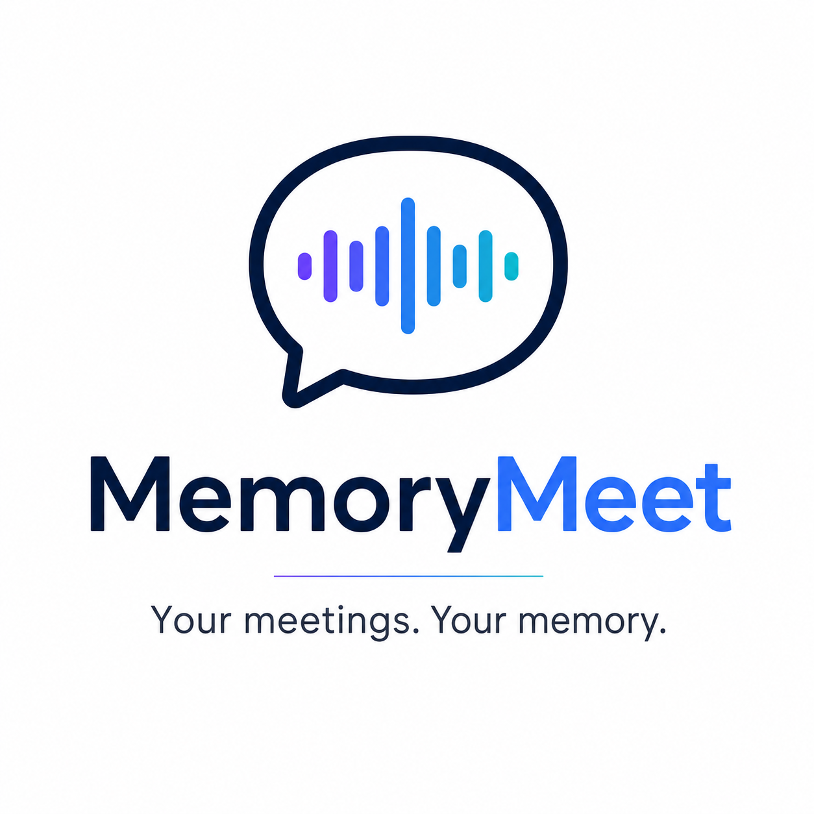

# MemoryMeet

<p align="center">
  
</p>

Memory fades. Conversations matter.

MemoryMeet is a lightweight, open-source meeting recorder and transcription tool that helps you preserve discussions exactly as they happened.

No subscriptions. No time limits. No distractions.

**Your meetings. Your memory.**

---

## Features

- Records microphone and system audio simultaneously
- Transcribes automatically using OpenAI Whisper
- Processes audio progressively in the background — no waiting at the end
- Saves MP3 + TXT to `~/Documents/MemoryMeet/`

## Requirements

- Windows 10/11
- Python 3.10+
- An OpenAI API key

## Setup

```bash
git clone https://github.com/raffacabofrio/memory-meet.git
cd memory-meet
pip install -r requirements.txt
cp .env.example .env
# Add your OpenAI API key to .env
python main.py
```

## Usage

1. Click **Gravar** to start recording
2. Click **Parar** when done
3. Click the file link to open the transcript

## License

MIT
