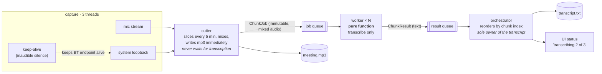

# MemoryMeet

<p align="center">
  
</p>

Memory fades. Conversations matter.

MemoryMeet is a lightweight, open-source meeting recorder and transcription tool that helps you preserve discussions exactly as they happened — who said what, labeled by speaker.

No subscriptions. No time limits. No distractions.

**Your meetings. Your memory.**

---

## Features

- Records microphone and system audio simultaneously (WASAPI loopback — captures any call app, no bot joining your meeting)
- Transcribes **and diarizes** progressively while you're still talking — no waiting at the end
- Speaker-labeled transcript with your names, not `SPEAKER_00`: labels are configurable (`MEMORYMEET_SPEAKER` / `MEMORYMEET_INTERLOCUTOR`)
- **Local-first**: transcription runs 100% on your machine by default (WhisperX) — no audio leaves your computer, no per-minute cost. OpenAI API available as a plug-in alternative
- Live progress in the UI: `transcribing 2 of 3` — never a blind spinner
- Saves MP3 + TXT to `~/Documents/MemoryMeet/`

## Architecture

The core is a producer/consumer pipeline where **all heavy work is a pure function** and **all side effects live in exactly one place**:


```mermaid
flowchart LR
    subgraph capture ["capture · 3 threads"]
        MIC["mic stream"]
        SYS["system loopback"]
        KA["keep-alive<br/>(inaudible silence)"]
    end

    CUT["cutter<br/>slices every 5 min, mixes,<br/>writes mp3 immediately<br/><i>never waits for transcription</i>"]
    JQ[["job queue"]]
    W["worker × N<br/><b>pure function</b><br/>transcribe only"]
    RQ[["result queue"]]
    ORC["orchestrator<br/>reorders by chunk index<br/><i>sole owner of the transcript</i>"]

    MIC --> CUT
    SYS --> CUT
    KA -. keeps BT endpoint alive .-> SYS

    CUT --> MP3[("meeting.mp3")]
    CUT -- "ChunkJob (immutable, mixed audio)" --> JQ --> W -- "ChunkResult (text)" --> RQ --> ORC

    ORC --> TXT[("transcript.txt")]
    ORC --> UI["UI status<br/>'transcribing 2 of 3'"]
```

- **Cutter (producer).** Slices the recording into fixed 5-minute chunks on a timer, mixes the channels, and **writes the MP3 bytes to disk right there** — before the chunk is even queued for transcription. It never blocks on transcription, and the audio never waits on it either.
- **Worker (pure).** `ChunkJob in → ChunkResult out`. Transcription only — no file writes, no UI, no shared state, and failures return a result carrying the error instead of raising — one bad chunk can't kill the pipeline or corrupt its neighbors, and a failed transcription never takes the chunk's audio down with it (that's already safely on disk). Purity is what makes `N` workers safe.
- **Orchestrator (single consumer).** Transcription results may arrive out of order; it holds them until the sequence is contiguous, then appends the TXT strictly in chunk order and updates the UI. MP3 and TXT each have exactly one writer thread (cutter and orchestrator respectively), on two different files — nothing to lock.

`MEMORYMEET_WORKERS` defaults to **1** — and that's a measured decision, not a placeholder: the inference engine (`ctranslate2`) already parallelizes internally (~3.5 cores during a transcription), the model stack holds ~4.7 GB of RAM, and the pyannote pipeline isn't safe for concurrent calls on a shared model. More workers only pay off with a GPU or one model per worker.

## Engineering notes (bugs that earned their place here)

**The snowball chunk.** The first pipeline was synchronous: slice → transcribe → only then slice again. On a CPU where transcription runs at ~1× real time, every chunk inherited the previous chunk's delay — a real 46-minute interview produced chunks of 5 → 9 → 14 → **18 minutes**, and the UI hung on "Finalizing" for 18 minutes after the call ended. The pipeline above decouples slicing from processing; the final wait is now bounded by one 5-minute chunk.

**Bluetooth loopback starvation.** WASAPI loopback stops delivering frames when nothing is playing — Bluetooth suspends the audio stream during silence. The system channel silently came up ~32% shorter than the mic channel, and since mixing pairs frames by index, the two voices overlapped into an unreadable "zipper" transcript. It looked exactly like a diarization bug; it was a capture-sync bug. Fix: a keep-alive thread plays continuous inaudible silence to the output, so the endpoint never suspends. After the fix, channel drift dropped from 32% to 0.3%.

**Stable speaker labels.** Diarization models renumber speakers on every call — chunk 1's `SPEAKER_00` may be chunk 2's `SPEAKER_01`. MemoryMeet exploits a physical fact: it already captures two separate channels (mic = you, system loopback = them). It scans each channel for its highest-energy ~8s window (likely the cleanest speech), gates on an energy floor so silence never becomes an anchor, and reuses those per-channel voice references across all chunks — labels stay consistent for the whole meeting.

**The last chunk that never made it to disk.** Until 2026-07-23, the MP3 append and the TXT append happened together in `_gravar_resultado`, both gated on the *entire* transcription finishing for that chunk — even though the mixed audio exists long before transcription even starts. Close the app (or have it crash) while the last chunk is still transcribing, and its audio — already cut, mixed, and sitting in memory — never reaches the consolidated MP3. It's not delayed, it's gone. Fix: the cutter now mixes and writes each chunk's MP3 immediately after slicing, decoupled from transcription entirely; only the TXT append stays gated on transcription success. Worst case now is a missing transcript for one chunk (recoverable by re-transcribing that slice of the MP3), never missing audio.

## Requirements

- Windows 10/11
- **Python 3.12** (exactly — see note below) for the default local backend; 3.10+ if you use the OpenAI backend
- A free Hugging Face token (default backend) — or an OpenAI API key, if you prefer the cloud backend

## Setup

The default backend (WhisperX) runs entirely on your CPU. Python **3.12 specifically**: `whisperx`'s
dependency chain (`faster-whisper`/`ctranslate2`) doesn't have wheels for very new Python versions yet
(checked against 3.14 on 03/07/2026).

```bash
git clone https://github.com/raffacabofrio/memory-meet.git
cd memory-meet
py -3.12 -m venv .venv
.venv\Scripts\pip install -r requirements.txt -r requirements-whisperx.txt
cp .env.example .env
```

The diarization model is gated on Hugging Face — one-time setup:

1. Create a Hugging Face account: https://huggingface.co/join
2. Accept the license at https://hf.co/pyannote/speaker-diarization-community-1 ("Agree and access repository")
   — if a dependent model also comes back gated, accept that one too the same way
3. Generate a read token: https://hf.co/settings/tokens
4. Add to `.env`: `HF_TOKEN=hf_...`

Then set your name for the transcript labels and run:

```bash
# in .env: MEMORYMEET_SPEAKER=YourName
.venv\Scripts\python main.py
```

First launch downloads the model weights (~1-2GB, one-time, cached afterward), so it takes a few
minutes to start. After that, models load eagerly at startup (~3 min on a modest CPU).

Optional tuning in `.env` (defaults shown):

```
WHISPERX_MODEL=small          # tiny|base|small|medium|large-v2 — bigger = slower on CPU, more accurate
WHISPERX_COMPUTE_TYPE=int8    # int8 is the CPU-friendly choice
WHISPERX_LANGUAGE=pt
MEMORYMEET_WORKERS=1          # parallel transcription workers — keep 1 on CPU (see Architecture)
```

Known limitation: with the WhisperX backend, speaker labels currently come out generic (`SPEAKER_00`, `SPEAKER_01`...)
instead of the configured names — mapping them via voice-reference embeddings is a follow-up, not yet implemented.
The OpenAI backend labels speakers by name.

## Alternative backend: OpenAI API

Transcription + diarization is a pluggable layer (`transcribers/`). If you'd rather not run models
locally (or your machine can't), switch to OpenAI's `gpt-4o-transcribe-diarize` — costs per minute,
audio goes to the API, but it's lighter to set up (any Python 3.10+, no model downloads):

```bash
pip install -r requirements.txt
# in .env:
#   TRANSCRIBER=openai
#   OPENAI_API_KEY=sk-...
python main.py
```

## Usage

1. Click **Gravar** to start recording
2. Click **Parar** when done
3. Click the file link to open the transcript

Wear headphones: with speakers, the mic re-captures the remote side and contaminates the voice references.

## License

MIT
