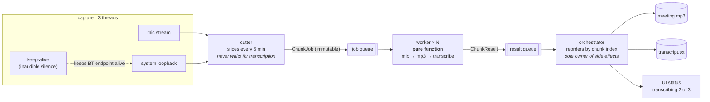

# MemoryMeet

<p align="center">
  
</p>

Memory fades. Conversations matter.

MemoryMeet is a lightweight, open-source meeting recorder and transcription tool that helps you preserve discussions exactly as they happened — who said what, labeled by speaker.

No subscriptions. No time limits. No distractions.

**Your meetings. Your memory.**

---

## Features

- Records microphone and system audio simultaneously (WASAPI loopback — captures any call app, no bot joining your meeting)
- Transcribes **and diarizes** progressively while you're still talking — no waiting at the end
- Speaker-labeled transcript: `[Raffa]` / `[Interlocutor]`, not `SPEAKER_00`
- Pluggable transcription backend: OpenAI API or 100% local (WhisperX), one env var to switch
- Live progress in the UI: `transcribing 2 of 3` — never a blind spinner
- Saves MP3 + TXT to `~/Documents/MemoryMeet/`

## Architecture

The core is a producer/consumer pipeline where **all heavy work is a pure function** and **all side effects live in exactly one place**:


```mermaid
flowchart LR
    subgraph capture ["capture · 3 threads"]
        MIC["mic stream"]
        SYS["system loopback"]
        KA["keep-alive<br/>(inaudible silence)"]
    end

    CUT["cutter<br/>slices every 5 min<br/><i>never waits for transcription</i>"]
    JQ[["job queue"]]
    W["worker × N<br/><b>pure function</b><br/>mix → mp3 → transcribe"]
    RQ[["result queue"]]
    ORC["orchestrator<br/>reorders by chunk index<br/><i>sole owner of side effects</i>"]

    MIC --> CUT
    SYS --> CUT
    KA -. keeps BT endpoint alive .-> SYS

    CUT -- "ChunkJob (immutable)" --> JQ --> W -- "ChunkResult" --> RQ --> ORC

    ORC --> MP3[("meeting.mp3")]
    ORC --> TXT[("transcript.txt")]
    ORC --> UI["UI status<br/>'transcribing 2 of 3'"]
```

- **Cutter (producer).** Slices the recording into fixed 5-minute chunks on a timer and enqueues an immutable `ChunkJob` — raw frames plus a snapshot of the speaker voice references. It never blocks on transcription.
- **Worker (pure).** `ChunkJob in → ChunkResult out`. No file writes, no UI, no shared state, and failures return a result carrying the error instead of raising — one bad chunk can't kill the pipeline or corrupt its neighbors. Purity is what makes `N` workers safe.
- **Orchestrator (single consumer).** Results may arrive out of order; it holds them until the sequence is contiguous, then appends MP3/TXT strictly in chunk order and updates the UI. Since it's the only thread with side effects, there's nothing to lock.

`MEMORYMEET_WORKERS` defaults to **1** — and that's a measured decision, not a placeholder: the inference engine (`ctranslate2`) already parallelizes internally (~3.5 cores during a transcription), the model stack holds ~4.7 GB of RAM, and the pyannote pipeline isn't safe for concurrent calls on a shared model. More workers only pay off with a GPU or one model per worker.

## Engineering notes (bugs that earned their place here)

**The snowball chunk.** The first pipeline was synchronous: slice → transcribe → only then slice again. On a CPU where transcription runs at ~1× real time, every chunk inherited the previous chunk's delay — a real 46-minute interview produced chunks of 5 → 9 → 14 → **18 minutes**, and the UI hung on "Finalizing" for 18 minutes after the call ended. The pipeline above decouples slicing from processing; the final wait is now bounded by one 5-minute chunk.

**Bluetooth loopback starvation.** WASAPI loopback stops delivering frames when nothing is playing — Bluetooth suspends the audio stream during silence. The system channel silently came up ~32% shorter than the mic channel, and since mixing pairs frames by index, the two voices overlapped into an unreadable "zipper" transcript. It looked exactly like a diarization bug; it was a capture-sync bug. Fix: a keep-alive thread plays continuous inaudible silence to the output, so the endpoint never suspends. After the fix, channel drift dropped from 32% to 0.3%.

**Stable speaker labels.** Diarization models renumber speakers on every call — chunk 1's `SPEAKER_00` may be chunk 2's `SPEAKER_01`. MemoryMeet exploits a physical fact: it already captures two separate channels (mic = you, system loopback = them). It scans each channel for its highest-energy ~8s window (likely the cleanest speech), gates on an energy floor so silence never becomes an anchor, and reuses those per-channel voice references across all chunks — labels stay consistent for the whole meeting.

## Requirements

- Windows 10/11
- Python 3.10+ (**3.12 exactly** for the local WhisperX backend)
- An OpenAI API key (default backend) — or nothing at all, if you use the local WhisperX backend

## Setup

```bash
git clone https://github.com/raffacabofrio/memory-meet.git
cd memory-meet
pip install -r requirements.txt
cp .env.example .env
# Add your OpenAI API key to .env
python main.py
```

## Transcription backend

Transcription + diarization is a pluggable layer (`transcribers/`). Pick one via `.env`:

```
TRANSCRIBER=openai      # default — calls OpenAI's gpt-4o-transcribe-diarize API, costs per minute
TRANSCRIBER=whisperx    # 100% local — faster-whisper + wav2vec2 + pyannote, no API calls, no cost
```

### WhisperX (local) setup

Runs entirely on your CPU — no audio ever leaves your machine, no per-minute cost. Requires **Python 3.12**
specifically: `whisperx`'s dependency chain (`faster-whisper`/`ctranslate2`) doesn't have wheels for very new
Python versions yet (checked against 3.14 on 03/07/2026). If your global Python is newer, create a dedicated venv:

```bash
py -3.12 -m venv .venv
.venv\Scripts\pip install -r requirements.txt -r requirements-whisperx.txt
.venv\Scripts\python main.py
```

The diarization model is gated on Hugging Face — one-time setup:

1. Create a Hugging Face account: https://huggingface.co/join
2. Accept the license at https://hf.co/pyannote/speaker-diarization-community-1 ("Agree and access repository")
   — if a dependent model also comes back gated, accept that one too the same way
3. Generate a read token: https://hf.co/settings/tokens
4. Add to `.env`: `HF_TOKEN=hf_...`

Optional tuning in `.env` (defaults shown):

```
WHISPERX_MODEL=small          # tiny|base|small|medium|large-v2 — bigger = slower on CPU, more accurate
WHISPERX_COMPUTE_TYPE=int8    # int8 is the CPU-friendly choice
WHISPERX_LANGUAGE=pt
MEMORYMEET_WORKERS=1          # parallel transcription workers — keep 1 on CPU (see Architecture)
```

First launch downloads the model weights (~1-2GB, one-time, cached afterward) and takes noticeably longer to
start than the OpenAI backend, since models load eagerly at startup rather than on first recording.

Known limitation: with the WhisperX backend, speaker labels currently come out generic (`SPEAKER_00`, `SPEAKER_01`...)
instead of the real names — mapping them via voice-reference embeddings is a follow-up, not yet implemented.
The OpenAI backend labels speakers by name.

## Usage

1. Click **Gravar** to start recording
2. Click **Parar** when done
3. Click the file link to open the transcript

Wear headphones: with speakers, the mic re-captures the remote side and contaminates the voice references.

## License

MIT
